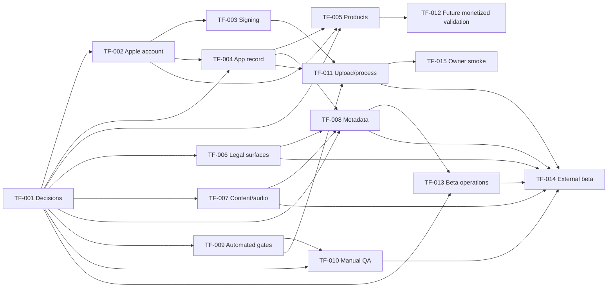

# Canonical TestFlight Task Register

_Last reconciled: 2026-08-14._

This is the source of truth for TestFlight work. Jira and Notion may mirror
these tasks, but they must not become authoritative. Every mirror uses the
unchanged `TF-###` ID and links to the corresponding repository file.

## Release target

- App: Svara
- Platform: iPhone / iOS 17+
- Bundle ID: `com.primandir.svara`
- Marketing version: `1.0`
- Current release-candidate build number: `5`, uploaded 2026-08-14 (builds 2
  and 3 are retained as historical processed evidence; build 3 cannot pass the
  owner audio smoke; build 4, uploaded 2026-08-13, is superseded because it
  predates the CNT-001/CNT-002 audio fixes in `1e69d00`). See
  `quality/evidence/appstoreconnect/BUILD-5-UPLOAD-2026-08-14.md`.
- Team configured in Xcode: `796XH483R4`
- Active target: owner internal smoke followed by an invitation-only,
  external close-friends beta (initial limit 10; no public link)
- Current group state: four owner-approved empty groups exist—internal
  `internal_family` and `internal_family_and_friends`, and external
  `external_family` and `external_family_and_friends`. Internal automatic
  distribution is disabled. No tester or build is assigned, no public link is
  enabled, and no external review submission was made. App Store Connect users
  remain preserved; membership and build allocation are intentionally pending.
- Deferred target: public App Store release and all monetization
- Factory lifecycle: `verification_pending` (build 5 automated pre-flight
  checks and signed upload pass; Apple processing confirmation,
  owner-group designation/membership, build 5 attachment, and the owner
  physical smoke are pending)

## Status rules

- `ready`: prerequisites exist and work can start.
- `in_progress`: work has started and the next required subtask input is
  available.
- `blocked`: a named dependency, permission, credential, or owner decision is
  missing.
- `verification_pending`: implementation exists but the task's mandatory check
  must be repeated or cannot run.
- `human_review_required`: automation cannot establish correctness.
- `done`: all acceptance criteria and evidence exist in the repository.

Never infer `done` from an App Store Connect screen alone. Update the repository
task and evidence first, then copy the same state to Jira/Notion.

## External mirror status

- **Jira:** not created. The connected site has no create-capable project named
  Svara. A project key must be selected or a Svara project created explicitly.
- **Notion:** not created. Workspace search found no Svara spec, plan, project,
  or task database. Existing task databases belong to other projects and must
  not be reused by inference.
- **Historical build 2 binary commit:**
  `6e9d0b16de5713119770fa160292442dbe32baba`.
- **Replacement build 3 binary commit:**
  `ed29548cd782ae6859b7d7b63c216f60693e8705`.
- **Build 4 binary commit (superseded, predates CNT-001/CNT-002):**
  `667b44c` (source unchanged from `9aa250b`).
- **Build 5 binary commit (current candidate):** `1e69d00`.
- **First processed-build evidence commit:**
  `df1dcdb` (`Record processed TestFlight build 2`). Later documentation-only
  reconciliation commits do not change the uploaded binary. Mirrors must
  record the latest pushed canonical commit plus the binary commit.

When destinations and a commit exist, create one parent Epic/plan and fifteen
children with the exact IDs, titles, statuses, dependencies, repository paths,
and commit SHA. Full descriptions and acceptance criteria may be copied as a
snapshot, but each mirror must say that repository content wins and link to the
canonical task.

## Task register

| ID | Task | Gate | Type | Status | Dependencies |
|---|---|---|---|---|---|
| TF-001 | Lock release decisions and owners | all | human | done | none |
| TF-002 | Verify Apple account, roles, agreements, tax, and banking | upload/IAP | human | done | TF-001 |
| TF-003 | Repair distribution signing and provisioning | upload | hybrid | done | TF-002 upload-role verification |
| TF-004 | Verify or create the App Store Connect app record | upload | hybrid | done | TF-001, TF-002 upload-role verification |
| TF-005 | Re-enable and reconcile future Svara Plus products | IAP | hybrid | deferred | TF-001, TF-002, TF-004 |
| TF-006 | Publish and verify legal/support/privacy surfaces | external | hybrid | human_review_required | owner legal approval and physical in-app link check |
| TF-007 | Complete cultural-content and audio-rights sign-off | factory/external | human | blocked | TF-001 |
| TF-008 | Complete App Store Connect and TestFlight metadata | external review | hybrid | in_progress | TF-001, TF-004; TF-006/TF-007 gate completion |
| TF-009 | Harden and rerun final automated release gates | upload | agent | done | TF-001 |
| TF-010 | Complete manual device, accessibility, audio, and permission QA | external | hybrid | human_review_required | TF-001, TF-009 |
| TF-011 | Produce, validate, upload, and process the signed build | upload | hybrid | done | TF-003, TF-004, TF-009 |
| TF-012 | Run future monetized TestFlight and live StoreKit sandbox validation | IAP | hybrid | deferred | TF-005; not applicable while Plus is disabled |
| TF-013 | Define beta operations, monitoring, triage, and stop criteria | external | hybrid | done | TF-001 |
| TF-014 | Submit TestFlight App Review and roll out the external cohort | external | human | blocked | TF-006, TF-007, TF-008, TF-010, TF-011, TF-013 |
| TF-015 | Run one-owner internal TestFlight smoke | internal owner | hybrid | blocked | designate existing internal group; add owner; attach/install/smoke build 5 |

## Dependency graph

Every arrow is a direct dependency from the task register. A task may start
only after all of its incoming tasks are `done`.

## Implementation plan

Execute the backlog in dependency order. The parent task file supplies the
complete implementation procedure; the table below tells a coordinator when a
task may start and what state must exist before advancing.

| Phase | Tasks | Start condition | Expected phase change / exit gate |
|---|---|---|---|
| 0 — Release decisions | TF-001 | Complete. | `DEC-005` identifies the private close-friends scope, required app-record values, roles, and commerce deferral. |
| 1 — Apple identity | TF-002 → TF-003; TF-004 after TF-002 | TF-001 is `done`; only membership, upload roles, current agreement, signing, App ID, and app-record state gate this milestone. | A valid signing path and exactly one correct Svara app record exist. Paid Apps, tax, and banking remain deferred with TF-005. |
| 2 — Candidate | TF-009 | TF-001 is `done`; this may run alongside TF-002–TF-004. | One identified external-eligible commit/build passes repository checks, tests, Release analysis, archive inspection, and CI. |
| 3 — Upload and owner smoke | TF-011 → TF-015 | TF-003, TF-004, and TF-009 are `done`; Apple account access is available. | Apple processes the external-eligible build and the owner installs it through TestFlight and completes the bounded smoke. |
| 4 — Close-friends readiness | TF-006–TF-008, TF-010, TF-013–TF-014 | Complete every listed dependency; TF-005/TF-012 remain deferred while commerce is disabled. | Legal, rights/cultural review, metadata, device QA, beta operations, and TestFlight App Review pass before invitations. |

### Coordinator and agent rules

1. Dispatch only a task whose register status is `ready`, or a specifically
   named subtask whose inputs are available. Do not bypass a `blocked`
   dependency to increase parallelism.
2. Give one agent one non-overlapping subtask ID and its canonical task file.
   The agent must read the execution rules, record evidence under the same ID,
   and return the observed expected change.
3. An agent may prepare worksheets, comparisons, commands, and sanitized
   evidence for a human/hybrid task. It may not invent owner decisions, accept
   agreements, assert legal/cultural/rights approval, use credentials it was
   not granted, or approve a release.
4. After every subtask, verify its artifact and update repository evidence
   before changing status or copying anything to Jira/Notion.
5. If a required input is missing, record the exact owner/action and set the
   parent to `blocked`, `verification_pending`, or `human_review_required` as
   defined above. Never reinterpret incomplete work as `done`.
6. Before a downstream phase starts, recheck dependency statuses and confirm no
   source, content, metadata, product, signing, or build identity change has
   invalidated earlier evidence.

## Release rules

- The upload may start only after TF-003, TF-004, and TF-009 are
  `done`.
- TF-005 and TF-012 are not applicable while Plus is disabled. TF-006–TF-008
  and TF-010 do not block the owner’s TF-015 smoke, but do block invitations.
- No internal tester invitation until the uploaded build is `Complete`.
- Do **not** mark a replacement build TestFlight Internal Only. It must remain eligible for
  the approved close-friends external cohort after owner smoke and review.
- No purchase/restore gate applies while Plus and product loading are disabled.
- No external invitation while audio rights or content sign-off are unresolved.
- Any binary change after TF-009 invalidates TF-009, TF-010, and the archive
  evidence. Increment the build number before uploading a replacement.
- Any content or audio change invalidates the applicable TF-007 sign-off.

## Detailed task files

Task execution instructions live under `docs/tasks/testflight/`. Read
`docs/tasks/testflight/README.md`, then the single assigned task file. Do not
perform downstream tasks opportunistically without their prerequisites.

## Subtask index

Descriptions, procedures, outputs, evidence, and stop conditions live in the
linked parent task file. Subtasks execute in the order shown.

| Task | Ordered subtasks |
|---|---|
| TF-001 | `TF-001.1` Build the decision worksheet `TF-001.2` Obtain explicit owner decisions `TF-001.3` Record DEC-005 `TF-001.4` Reconcile every dependent source `TF-001.5` Close the decision gate |
| TF-002 | `TF-002.1` Verify membership and team identity `TF-002.2` Verify roles and app access `TF-002.3` Resolve agreements `TF-002.4` Verify banking and tax readiness `TF-002.5` Run capability checks and close |
| TF-003 | `TF-003.1` Capture the signing baseline `TF-003.2` Establish an authorized distribution identity `TF-003.3` Configure Svara signing and provisioning `TF-003.4` Produce and inspect a signed archive `TF-003.5` Record reproducibility and resolve REL-001 |
| TF-004 | `TF-004.1` Search existing Apple records `TF-004.2` Validate required creation values `TF-004.3` Create only missing records `TF-004.4` Verify resulting identity `TF-004.5` Reconcile repository and close ASM-001 |
| TF-005 | `TF-005.1` Freeze the product contract `TF-005.2` Configure the subscription group and plans `TF-005.3` Configure the lifetime product `TF-005.4` Complete commercial and review metadata `TF-005.5` Reconcile code, fixture, UI, and copy `TF-005.6` Run local StoreKit scenarios `TF-005.7` Close the catalog gate |
| TF-006 | `TF-006.1` Audit canonical source against the build `TF-006.2` Obtain legal and contact approval `TF-006.3` Deploy the approved commit `TF-006.4` Verify live transport and content `TF-006.5` Verify in-app links on device `TF-006.6` Reconcile metadata and close REL-006 |
| TF-007 | `TF-007.1` Freeze content and audio inventory `TF-007.2` Perform item-level cultural review `TF-007.3` Resolve and re-review content issues `TF-007.4` Establish rights for every audio file `TF-007.5` Review audio content and technical quality `TF-007.6` Run final automated content gates `TF-007.7` Approve the frozen distribution set |
| TF-008 | `TF-008.1` Freeze and validate canonical metadata `TF-008.2` Complete app identity and classification fields `TF-008.3` Complete and publish App Privacy `TF-008.4` Complete age, rights, and export declarations `TF-008.5` Enter TestFlight test information `TF-008.6` Perform repository-to-Apple comparison and close |
| TF-009 | `TF-009.1` Freeze the candidate identity and environment `TF-009.2` Run repository and configuration gates `TF-009.3` Run the complete automated test action `TF-009.4` Run Release static analysis `TF-009.5` Create and inspect a fresh Release archive `TF-009.6` Harden and verify CI `TF-009.7` Assemble final evidence and freeze downstream |
| TF-010 | `TF-010.1` Prepare the QA matrix and clean states `TF-010.2` Verify layout, appearance, and Dynamic Type `TF-010.3` Verify VoiceOver and motion/color alternatives `TF-010.4` Verify primary workflows and persistence `TF-010.5` Verify real audio and route behavior `TF-010.6` Verify notification permission and delivery `TF-010.7` Verify paywall accessibility and failure states `TF-010.8` Triage, re-test, and close REL-005 |
| TF-011 | `TF-011.1` Run signed-build preflight `TF-011.2` Create and identify the signed archive `TF-011.3` Validate the archive `TF-011.4` Upload exactly once `TF-011.5` Wait for and resolve processing `TF-011.6` Inspect Apple build metadata and close |
| TF-012 | `TF-012.1` Configure internal group and testers `TF-012.2` Install and run distributed-build smoke `TF-012.3` Verify live product catalog and prices `TF-012.4` Verify successful purchases `TF-012.5` Verify cancellation, pending, and restore `TF-012.6` Verify entitlement lifecycle and offline behavior `TF-012.7` Make internal go/no-go decision |
| TF-013 | `TF-013.1` Define staged cohorts and distribution controls `TF-013.2` Assign monitoring and response ownership `TF-013.3` Define severity and repository-first triage `TF-013.4` Approve stop and escalation criteria `TF-013.5` Define replacement-build procedure `TF-013.6` Define mirror and secure-data handling `TF-013.7` Tabletop, approve, and close |
| TF-014 | `TF-014.1` Run external-release preflight `TF-014.2` Configure the external group `TF-014.3` Submit once and monitor TestFlight App Review `TF-014.4` Handle rejection without bypassing gates `TF-014.5` Invite the approved initial cohort `TF-014.6` Verify the external tester journey `TF-014.7` Observe, decide expansion, and close |
| TF-015 | `TF-015.1` Verify the sole internal tester and group `TF-015.2` Attach the processed internal-only build `TF-015.3` Install exclusively through TestFlight `TF-015.4` Run the bounded owner smoke `TF-015.5` Record issues and close the private milestone |

## App Store release work intentionally deferred

The following are not blockers for the external TestFlight build unless
App Store Connect makes them mandatory for the selected workflow:

- final App Store product-page screenshots and preview video;
- final public release description/copyright;
- submitting the first subscription and non-consumable with the public app
  version;
- production storefront rollout and phased release.

If App Store Connect requires one during TestFlight setup, record the observed
requirement in TF-008 and promote it into the critical path rather than guessing.
